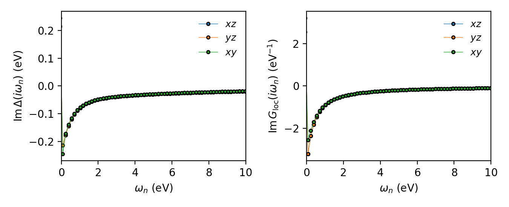
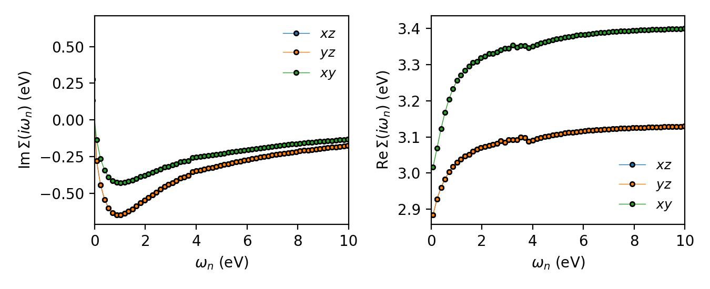

.. _tutorials_rotating_to_a_local_basis:

Rotating to a local basis: Sr\ :sub:`2`\ MgOsO\ :sub:`6`
********************************************************

.. contents:: Contents
   :local:
   :depth: 2

When the correlated atom sits in a distorted environment — tilted or rotated
oxygen octahedra, a low-symmetry crystal field — the local Hamiltonian and the
hybridization function acquire off-diagonal components. Many impurity solvers,
in particular the continuous-time hybridization-expansion family (CT-HYB,
CT-SEG), prefer a *diagonal* hybridization. This is to reduce the Monte-Carlo sign problem.

This tutorial goes over how to handle this problem. We then run one DMFT iteration 
and plot the result. The material is the double perovskite Sr\ :sub:`2`\ MgOsO\ :sub:`6`, 
whose OsO\ :sub:`6` octahedra are rotated relative to the cubic axes. The correlated shell 
is the Os :math:`5d` manifold, downfolded to five orbitals; only the low-lying
:math:`t_{2g}`-like states are physically relevant, and those are the ones we
will end up treating as our quantum impurity model.

Learning outcomes
=================

By the end of this tutorial you will know how to:

* diagnose off-diagonal hybridization by inspecting
  :py:func:`~triqs_modest.atomic_levels_and_delta.impurity_levels` and the
  atomic block decomposition (``irreps``) reported by an OBE;
* diagonalize the local Hamiltonian at load time with
  ``diagonalize_hloc=True``, either within the discovered symmetry blocks or,
  with ``threshold=-1``, across the full local Hamiltonian at once;
* reshape an :ref:`embedding <reference/python/embedding>` with
  ``split_imp_block``, ``split_imp``, and ``drop_imp`` to carve out exactly
  the correlated subspace you want to solve — here, the :math:`t_{2g}`
  triplet — without touching the DFT input;
* keep an interaction :math:`U`-matrix consistent with a rotated OBE basis by
  carrying it through the same chain of rotations
  (``rotation_from_dft_to_local_basis``);
* run one DMFT iteration end to end — chemical potential, local Green's
  function, hybridization, CT-HYB — and checkpoint the result with
  :py:class:`~triqs_modest.utils.checkpoint.Checkpointer` and
  :py:class:`~triqs_modest.utils.file_io.IterationData`.

Files
=====

Everything needed to run this tutorial is provided in the following files:

* converted DFT archive: :download:`Sr2MgOsO6.h5 <Sr2MgOsO6.h5>`
* scripts: :download:`setup.py <setup.py>`, :download:`dmft.py <dmft.py>`,
  :download:`plot.py <plot.py>`

Step 1 — Diagnose the off-diagonal hybridization
================================================

We start by loading the one-body elements (OBE) straight from the DFT
converter, with no basis manipulation, and inspecting the local impurity
levels :math:`h_{\mathrm{loc}} = \sum_\mathbf{k} P(\mathbf{k})\,H(\mathbf{k})\,P^\dagger(\mathbf{k})`:

.. code-block:: python

   import numpy as np; np.set_printoptions(precision=3, suppress=True)
   import triqs_modest as tm

   _, obe1 = tm.one_body_elements_from_dft_converter("Sr2MgOsO6.h5")

   for block in tm.impurity_levels(obe1):
       print(np.array(block))

The :math:`5\times5` impurity-level matrix is **not** diagonal:

.. code-block:: text

   [[ 4.51 +0.j     0.   -0.j    -0.   -0.j    -0.   -0.j    -0.   +0.j   ]
    [ 0.   +0.j     0.399-0.j     0.   +0.824j -0.   -0.j    -0.   -0.j   ]
    [-0.   +0.j     0.   -0.824j  4.936+0.j    -0.   -0.j     0.   -0.j   ]
    [-0.   +0.j    -0.   +0.j    -0.   +0.j     0.15 -0.j     0.   +0.j   ]
    [-0.   -0.j    -0.   +0.j     0.   +0.j     0.   -0.j     0.15 -0.j   ]]

Notice the :math:`\pm0.824i` element coupling orbitals 1 and 2. The octahedral
rotation mixes the cubic orbitals, so the basis we constructed the projectors in
is not an eigenbasis of the local problem. If we computed the hybridization
function :math:`\Delta(i\omega_n)` in this basis it would inherit the same
off-diagonal structure,

.. math::

   \Delta \;=\;
   \begin{pmatrix}
     \times &        &        &        &        \\
            & \times & \times &        &        \\
            & \times & \times &        &        \\
            &        &        & \times &        \\
            &        &        &        & \times
   \end{pmatrix},

which is what we are trying to avoid. ModEST has already *discovered* this block structure 
— the atomic decomposition reported by ``print(obe1)`` reads ``irreps: [1, 2, 1, 1]``, 
i.e. one :math:`2\times2` block (the mixed pair) plus three singlets.

Step 2 — Diagonalize the local Hamiltonian
==========================================

The remedy is a unitary rotation :math:`R` that diagonalizes
:math:`h_{\mathrm{loc}}`. You can build :math:`R` yourself from the eigenvectors
of the impurity levels (or of the local density matrix) and apply it with
``tm.rotate_to_local_basis(R, obe)`` — but ModEST can do it for you at construction
with ``diagonalize_hloc=True``:

.. code-block:: python

   # diagonalize within the block structure discovered above
   _, obe2 = tm.one_body_elements_from_dft_converter(
       "Sr2MgOsO6.h5", diagonalize_hloc=True)

   # diagonalize the full 5x5 block at once (threshold=-1 disables the block split)
   _, obe3 = tm.one_body_elements_from_dft_converter(
       "Sr2MgOsO6.h5", diagonalize_hloc=True, threshold=-1)

``obe2`` diagonalizes *within* the ``[1, 2, 1, 1]`` blocks that were found
automatically. ``obe3`` goes one step further: passing ``threshold=-1`` turns off
the block detection, so the whole :math:`5\times5` matrix is diagonalized in one
shot. The eigenvalues are the same either way, but ``obe3`` returns them **sorted
in increasing order**, which is convenient — the correlated :math:`t_{2g}` states
end up first. The local levels of ``obe3`` are now fully diagonal:

.. code-block:: text

   [[0.15  0.    0.    0.    0.   ]
    [0.    0.15  0.    0.    0.   ]
    [0.    0.    0.254 0.    0.   ]
    [0.    0.    0.    4.51  0.   ]
    [0.    0.    0.    0.    5.081]]

The three low-lying levels (:math:`0.15,\,0.15,\,0.254` eV) are the
:math:`t_{2g}`-like crystal-field states; the two high ones
(:math:`4.51,\,5.081` eV) are the :math:`e_g`-like states, pushed up by the
ligand field and irrelevant to the low-energy physics. In this rotated basis the
hybridization function is diagonal, and the rotation matrices used to get here
are stored on the OBE at
``obe.C_space.rotation_from_dft_to_local_basis`` — we will need them again when
we build the interaction.

Step 3 — Shape the embedding
============================

We build the :ref:`embedding <reference/python/embedding>` from ``obe3`` and then
manipulate it to match our desired form. The embedding is the bookkeeper that routes
quantities between the lattice (correlated subspace :math:`\mathcal{C}`) and the
impurity solver; transforming it lets us decide *which* orbitals become *which*
impurity.

.. code-block:: python

   E1 = tm.make_embedding(obe3.C_space)           # one 5-orbital impurity block
   E2 = E1.split_imp_block(0, 0, [1, 1, 1, 2])    # split 5 -> 1+1+1+2 (t2g singlets + eg doublet)
   E3 = E2.split_imp(0, [0, 1, 2])                # separate the three t2g blocks from the eg block
   E  = E3.drop_imp(1)                            # drop the eg impurity — keep only the t2g

Reading the ``E.description(True)`` output at each step:

* ``E1`` is a single :math:`5\times5` impurity block.
* ``E2`` splits that block into ``[1, 1, 1, 2]`` — three :math:`t_{2g}`
  singlets and the :math:`e_g` doublet — but all still in one impurity.
* ``E3`` moves the three singlets into impurity ``0`` and the doublet into a
  second impurity ``1``.
* ``E  = E3.drop_imp(1)`` drops impurity ``1``, leaving a clean three-orbital :math:`t_{2g}`
  impurity with diagonal blocks ``up_0 [1], up_1 [1], up_2 [1]`` (and their spin
  partners). These three blocks are the :math:`t_{2g}` orbitals: the degenerate
  pair ``up_0``/``up_1`` is :math:`xz`/:math:`yz` and the singlet ``up_2`` is
  :math:`xy`.

That three-orbital, block-diagonal impurity is exactly what we want.

Step 4 — Run one DMFT iteration
===============================

With the model in hand, one DMFT iteration is the standard ModEST loop. The full
script is ``dmft.py``; the essential pieces are:

.. code-block:: python

   from triqs.gfs import MeshImFreq
   from triqs_cthyb import solve_generic, TailFitParams
   from triqs_modest.utils import Checkpointer, IterationData

   U, J, beta = 2.0, 0.20, 40
   mesh = MeshImFreq(beta=beta, statistic="Fermion", n_iw=int(beta * 10))

   # one-body elements in the rotated basis + the shaped embedding
   target_density, obe = tm.one_body_elements_from_dft_converter(
       "Sr2MgOsO6.h5", diagonalize_hloc=True, threshold=-1)
   E = tm.make_embedding(obe.C_space).split_imp_block(0, 0, [1, 1, 1, 2]) \
        .split_imp(0, [0, 1, 2]).drop_imp(1)

Because we rotated the problem, the interaction has to be expressed in the same
basis. We build the Slater :math:`U`-matrix in the spherical-harmonic basis, then
carry it through the *same* chain of rotations that took the orbitals from DFT to
our local basis: spherical → cubic (the Wien2k convention used by the converter)
→ local, using the stored ``rotation_from_dft_to_local_basis``. Finally we slice
out the block that belongs to our :math:`t_{2g}` impurity:

.. code-block:: python

   from triqs.operators.util.U_matrix import (
       U_matrix_slater, transform_U_matrix, spherical_to_cubic)
   from triqs.operators.util.hamiltonians import h_int_slater

   R_mat = list(obe.C_space.rotation_from_dft_to_local_basis)[0]
   U_mat = U_matrix_slater(l=2, U_int=U, J_hund=J, basis="spherical")
   U_mat = transform_U_matrix(U_mat, spherical_to_cubic(l=2, convention="wien2k"))
   U_mat = transform_U_matrix(U_mat, R_mat.conjugate().T)
   Uimp  = (E.merge_embed_block_by_imp.slice_sigma).extract([U_mat])[0][0].real

   spin_names = E.sigma_names
   n_orb = len(E.imp_decomposition(0))
   map_to_solver = {(sp, o): (f"{sp}_{o}", 0) for sp in spin_names for o in range(n_orb)}
   h_int = h_int_slater(spin_names, n_orb, Uimp, map_operator_structure=map_to_solver)

The rest of the the loop is the same  — find the chemical potential,
compute the local Green's function, extract the impurity levels and
hybridization, and hand :math:`(\Delta, \epsilon_d, H_{\mathrm{int}})` to the
solver:

.. code-block:: python

   mu    = tm.find_chemical_potential(target_density, obe, beta, verbosity=False)
   Gloc  = E.extract(tm.gloc(mesh, obe, mu))[0]
   deg_blocks = tm.analyze_degenerate_blocks(Gloc)          # exploit t2g degeneracies

   dc = tm.DcSolver("NonPolarized", "cFLL", U, J)
   Sigma_dc = dc.dc_self_energy(Gloc)

   Sigma_imp_dyn, Sigma_imp_hf = E.make_zero_imp_self_energies(mesh)[0]
   for ibl, _ in enumerate(Sigma_imp_hf):
       Sigma_imp_hf[ibl] += Sigma_dc[ibl]

   epsilon_d = E.extract(tm.impurity_levels(obe))[0]

   Sigma_C = E.embed([Sigma_imp_dyn], [[s - d for s, d in zip(Sigma_imp_hf, Sigma_dc)]])
   mu      = tm.find_chemical_potential(target_density, obe, *Sigma_C, verbosity=False)
   Gloc    = E.extract(tm.gloc(obe, mu, *Sigma_C))[0]
   ed      = [(b - mu - d).real for b, d in zip(epsilon_d, Sigma_dc)]
   Delta   = tm.symmetrize(tm.hybridization(ed, Gloc, Sigma_imp_dyn, Sigma_imp_hf), deg_blocks)

   res = solve_generic(Delta, ed, h_int, **solver_params)   # (Σ_imp, G_imp)

Every iteration is written to a checkpoint so it can be reopened for
post-processing (and the run can be restarted):

.. code-block:: python

   ckpt = Checkpointer(f"beta{beta}_U{U}_J{J}.ckpt")
   ckpt.append(IterationData(mu=mu,
                             Sigma_imp_list=[res.Sigma_dynamic],
                             Sigma_hartree_list=[res.Sigma_HartreeFock],
                             Gimp_list=[res.G_iw], Gloc_list=[Gloc], Delta_list=[Delta]))

Run it (in parallel with MPI if you like)::

   python dmft.py            # or: mpirun -n 8 python dmft.py

The result
==========

The payoff of the rotation is visible directly in the hybridization function.
``plot.py`` reopens the checkpoint and pulls the last iteration:

.. code-block:: python

   from triqs_modest.utils import Checkpointer

   ckpt = Checkpointer(f"beta{beta}_U{U}_J{J}.ckpt")
   last = ckpt[len(ckpt) - 1]
   Delta = last.Delta_list[0]      # hybridization on the t2g impurity
   Gloc  = last.Gloc_list[0]       # local Green's function

Each block of ``Delta`` is now a scalar :math:`1\times1` Green's function: the
off-diagonal hybridization we started with has been rotated away, exactly as
intended. Plotting :math:`\mathrm{Im}\,\Delta(i\omega_n)` and
:math:`\mathrm{Im}\,G_{\mathrm{loc}}(i\omega_n)` for the three
:math:`t_{2g}` orbitals shows the crystal-field splitting resolved into clean,
independent channels — two degenerate levels and one slightly higher, mirroring
the :math:`0.15,\,0.15,\,0.254` eV levels we saw above.

   Left: the diagonal :math:`t_{2g}` hybridization
   :math:`\mathrm{Im}\,\Delta(i\omega_n)`. Right: the local Green's function
   :math:`\mathrm{Im}\,G_{\mathrm{loc}}(i\omega_n)`. Both are block-diagonal in
   the rotated basis — the off-diagonal hybridization is gone.

The impurity self-energy is what the solver actually produced. It is stored in
two pieces — the dynamic (frequency-dependent) part in ``Sigma_imp_list`` and
the static Hartree-Fock shift in ``Sigma_hartree_list`` — so the full
:math:`\Sigma(i\omega_n)` is the sum of the two:

.. code-block:: python

   Sigma_dyn = last.Sigma_imp_list[0]
   Sigma_hf  = last.Sigma_hartree_list[0]

   Sigma = Sigma_dyn.copy()
   for ibl, (bl, g) in enumerate(Sigma):
       Sigma[bl] << g + Sigma_hf[ibl]

   The :math:`t_{2g}` impurity self-energy :math:`\Sigma(i\omega_n)`.
   :math:`\mathrm{Im}\,\Sigma` (left) vanishes as :math:`\omega_n \to \infty` and
   its low-frequency slope measures the mass renormalization;
   :math:`\mathrm{Re}\,\Sigma` (right) tends to the static Hartree-Fock shift at
   large :math:`\omega_n`. The two crystal-field-degenerate orbitals
   (:math:`xz`, :math:`yz`) fall on top of each other, while :math:`xy` is
   distinct — the same splitting seen in the local levels.

Takeaways
=========

* Inspect ``tm.impurity_levels(obe)`` early — off-diagonal elements are a sign
  the DFT basis is not the natural one to solve in.
* ``diagonalize_hloc=True`` rotates to a diagonal local basis;
  ``threshold=-1`` additionally sorts the crystal-field levels so the relevant
  orbitals come first.
* The embedding transformations (``split_imp_block``, ``split_imp``,
  ``drop_imp``) let you carve the exact impurity model you want — here, the
  three :math:`t_{2g}` orbitals — without touching the DFT input.
* Keep the interaction consistent by rotating the :math:`U`-matrix with the same
  ``rotation_from_dft_to_local_basis``.
