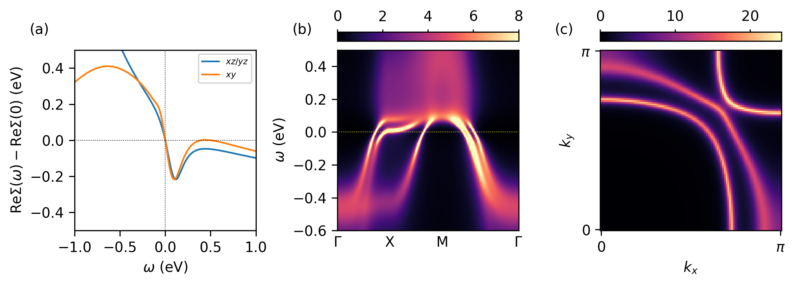

.. _tutorial_sro_superdispersion:

Interacting spectral function of Sr\ :sub:`2`\ RuO\ :sub:`4`
************************************************************

.. contents:: Contents
   :local:
   :depth: 2

The momentum-resolved single-particle spectral function :math:`A(\mathbf{k},\omega)`
is what connects a DFT+DMFT calculation to angle-resolved photoemission
spectroscopy (ARPES). This tutorial computes :math:`A(\mathbf{k},\omega)` for
the Hund's metal Sr\ :sub:`2`\ RuO\ :sub:`4`, and reproduces two hallmarks of
its correlated electronic structure reported in

    A. Tamai, M. Zingl, E. Rozbicki, E. Cappelli, S. Riccò, A. de la Torre,
    S. McKeown Walker, F. Y. Bruno, P. D. C. King, W. Meevasana, M. Shi,
    M. Radović, N. C. Plumb, A. S. Gibbs, A. P. Mackenzie, C. Berthod,
    H. U. R. Strand, M. Kim, A. Georges, and F. Baumberger,
    *High-Resolution Photoemission on Sr*\ :sub:`2`\ *RuO*\ :sub:`4` *Reveals
    Correlation-Enhanced Effective Spin-Orbit Coupling and Dominantly Local
    Self-Energies*,
    `Phys. Rev. X 9, 021048 (2019) <https://doi.org/10.1103/PhysRevX.9.021048>`_,

namely a **hairpin feature at the BZ corner** — the "Hund's superdispersion"
recently confirmed by tunneling spectroscopy in

    L. C. Rhodes, F. B. Kugler, O. Gingras, C. Marques, E. Abarca Morales,
    P. D. C. King, A. Georges, and P. Wahl,
    *Revealing Hund superdispersion with tunneling spectroscopy*,
    `arXiv:2605.16580 <https://arxiv.org/abs/2605.16580>`_,

and an interacting Fermi surface that matches high-precision ARPES.

Unlike the other tutorials, the focus here is not on running the DMFT loop —
we ship the converged self-energy directly — but on **building one-body
elements from a tight-binding model** (rather than a DFT-converter archive)
and using them, together with a converged self-energy, to compute
:math:`A(\mathbf{k},\omega)`.

Learning outcomes
=================

By the end of this tutorial you will know how to:

* build one-body elements directly from a Wannier90 tight-binding
  Hamiltonian with
  :py:func:`~triqs_modest.obe_tb.one_body_elements_from_wannier90`;
* extend a spinless tight-binding model to a spinful one with
  :py:func:`~triqs_modest.obe_tb.extend_to_spin`, and add a local
  (:math:`\mathbf{k}`-independent) term such as spin-orbit coupling with
  :py:func:`~triqs_modest.obe_tb.add_local_term`;
* isolate the dynamical part of a converged DMFT self-energy and route it
  onto the embed space with
  :py:func:`~triqs_modest.embedding.make_embedding`;
* compute and interpret the interacting spectral function
  :math:`A(\mathbf{k},\omega)`, both along a high-symmetry path and on a
  Fermi-surface grid, with
  :py:func:`~triqs_modest.post_processing.spectral_function_on_high_symmetry_path`.

.. note::

   This tutorial starts from a converged DMFT calculation. The
   DMFT loop that produces it is a standard one-shot calculation, of the kind
   worked through in :ref:`tutorial_svo_dmft`: the
   correlated subspace is the Ru-:math:`t_{2g}` shell, the impurity problem is
   solved with CT-HYB, and the interaction is a Kanamori Hamiltonian with
   :math:`U=2.3`\ eV, :math:`J=0.4`\ eV, :math:`U^\prime = U-2J` at
   :math:`\beta=200`\ eV\ :sup:`-1` (:math:`T\simeq58`\ K). The converged
   Matsubara self-energy is continued to the real axis with Padé
   approximants. 

Files
=====

* tight-binding Hamiltonian: :download:`sro <sro_tb.dat>` (Wannier90
  ``_tb.dat`` format, seedname ``sro``)
* analytically continued self-energy: :download:`Sigma_w.h5 <Sigma_w.h5>`
* plotting script: :download:`plot.py <plot.py>`

Step 1 — Build one-body elements from a tight-binding model
===========================================================

We build the one-body elements directly from a Wannier90 tight-binding Hamiltonian for
the Ru-:math:`t_{2g}` manifold with
:py:func:`~triqs_modest.obe_tb.one_body_elements_from_wannier90`. Following
Ref. Tamai *et al.*, we then add a **correlation-enhanced spin-orbit
coupling** term on top of the bare :math:`t_{2g}` Hamiltonian, and extend the
spinless model to spinful with
:py:func:`~triqs_modest.obe_tb.extend_to_spin` and
:py:func:`~triqs_modest.obe_tb.add_local_term`:

.. literalinclude:: plot.py
   :language: python
   :start-at: obe = tm.one_body_elements_from_wannier90
   :end-at: obe = tm.add_local_term

Two things happen here:

* :py:func:`~triqs_modest.obe_tb.extend_to_spin` takes the spinless,
  3-orbital :math:`H(\mathbf{k})` and duplicates it into a **block-diagonal**
  6-orbital Hamiltonian, :math:`H(\mathbf{k})\to\mathrm{diag}(H(\mathbf{k}),
  H(\mathbf{k}))`. The first three indices of the new orbital space are the
  spin-up copy :math:`(xz,yz,xy)_\uparrow`, and the last three are the
  spin-down copy :math:`(xz,yz,xy)_\downarrow`. On its own this only encodes
  a trivially spin-degenerate model — the two spin sectors are decoupled
  copies of the same non-relativistic bands, with no coupling between them
  yet.

* ``Hsoc(lambda_soc)`` builds the 6×6 **atomic** (:math:`\mathbf{k}`-independent)
  spin-orbit matrix in that same composite (orbital, spin) basis. It has two
  kinds of entries: same-spin terms that mix orbitals within one spin sector
  (e.g. ``lam_loc[1,2]``, coupling :math:`yz_\uparrow` and
  :math:`xy_\uparrow`), and spin-flip terms that couple the two spin sectors
  across the up/down block boundary (e.g. ``lam_loc[0,4]``, coupling
  :math:`xz_\uparrow` and :math:`yz_\downarrow`). It is precisely these
  spin-flip elements that turn the artificially spin-degenerate model from
  ``extend_to_spin`` into a genuine, non-collinear SOC-coupled one. Only the
  strictly upper-triangular entries are written explicitly; adding the
  Hermitian conjugate (``lam_loc + lam_loc.conj().T``) fills in the rest and
  guarantees a physically valid (Hermitian) local term.

:py:func:`~triqs_modest.obe_tb.add_local_term` then inserts this 6×6 matrix
into the on-site (:math:`\mathbf{k}`-independent, :math:`\mathbf{R}=0`)
hopping of the doubled tight-binding model — it is the only piece of
:math:`H_{\mathrm{SOC}}` that survives the Fourier transform to
:math:`H(\mathbf{k})`, since spin-orbit coupling here is a purely atomic
(on-site) effect. 

Step 2 — Isolate the dynamical self-energy
==========================================

The Green's function evaluated on this tight-binding model is

.. math::

   G^{-1}(\mathbf{k},\omega) =  (\omega + \mu)\mathbb{1} - H(\mathbf{k}) - H_{\mathrm{SOC}} - \Sigma(\omega).

Reference Tamai *et al.* shows that excellent agreement with laser-ARPES is
obtained by removing the **static** part of the self-energy,
:math:`\widetilde{\Sigma}(\omega) = \Sigma(\omega) - \mathrm{Re}\,\Sigma(0)`,
so that only its dynamical (energy-dependent) enters the calculation of the interacting spectral function. 

.. literalinclude:: plot.py
   :language: python
   :start-at: with HDFArchive(SW_FILE)
   :end-at: Sigma_phen[bl] -= sig(0.0).real

The self-energy is stored as six diagonal, spin-resolved
:math:`t_{2g}` blocks (``up_0``, ``up_1``, ``up_2``, ``down_0``, ``down_1``,
``down_2``) from the CT-HYB solution, with orbitals ``0``/``1`` the
degenerate :math:`xz`/:math:`yz` pair and orbital ``2`` the :math:`xy`
orbital. A key signature of Hund's physics is visible directly in
:math:`\mathrm{Re}\,\Sigma(\omega)`: its slope changes sign around
:math:`\omega \approx 100`\ meV, and this is what ultimately drives the
superdispersion feature below.

Step 3 — Embed the self-energy and compute :math:`A(\mathbf{k},\omega)`
=======================================================================

The impurity self-energy blocks must be routed onto the six-dimensional
:math:`(xz,yz,xy)\otimes(\uparrow,\downarrow)` embed space that matches the
ordering used in :math:`H_{\mathrm{SOC}}`. Because there is a single impurity
and no spin mixing at the impurity level, this is a simple
:py:func:`~triqs_modest.embedding.make_embedding` call with one ``"ud"``
channel and one impurity:

.. literalinclude:: plot.py
   :language: python
   :start-at: E = tm.make_embedding
   :end-at: Sigma_C = E.embed([Sigma_phen])

With the embedded self-energy :math:`\Sigma_C(\omega)` in hand,
:py:func:`~triqs_modest.post_processing.spectral_function_on_high_symmetry_path`
evaluates :math:`A(\mathbf{k},\omega) = -\pi^{-1}\mathrm{Tr}\,\mathrm{Im}\,G(\mathbf{k},\omega)`
on any list of :math:`\mathbf{k}`-points — a high-symmetry path for the band
structure, or a dense 2D grid at :math:`k_z=0` for the Fermi surface
(:math:`A(\mathbf{k},\omega=0)`):

.. literalinclude:: plot.py
   :language: python
   :start-at: # A(k,w) along the high-symmetry path
   :end-at: A0 = Akw_fs.total[0][:, iw0].reshape(nk_fs, nk_fs)

Note that ``eF`` is passed as the chemical potential: because the
tight-binding Hamiltonian keeps the absolute DFT energy scale, the
non-interacting Fermi level from the Wannier90 calculation is used directly,
rather than being redetermined with
:py:func:`~triqs_modest.rho_and_mu.find_chemical_potential`.

The result
==========

   (a) :math:`\mathrm{Re}\,\Sigma(\omega) - \mathrm{Re}\,\Sigma(0)` for the
   :math:`xz/yz` and :math:`xy` orbitals — the slope inversion near
   :math:`\omega\approx100`\ meV is the hallmark of Hund's physics discussed
   above, and agrees with real-frequency numerical renormalization group
   results (`Kugler et al., PRL 124, 016401 (2020)
   <https://doi.org/10.1103/PhysRevLett.124.016401>`_). (b) :math:`A(\mathbf{k},\omega)`
   along high-symmetry lines. (c) :math:`A(\mathbf{k},0)` in the upper-right
   quadrant of the :math:`k_z=0` plane — the interacting Fermi surface.

Two features stand out in panel (b): the overall bandwidth is dramatically
reduced relative to the bare DFT dispersion, and there is a **hairpin
feature at the M point**. That hairpin is the Hund's superdispersion: the
sign change in :math:`\mathrm{Re}\,\Sigma(\omega)` at :math:`\omega\approx100`\ meV
locally *un*-renormalizes the band right where it would otherwise be most
strongly damped, folding the dispersion back on itself. This effect is a
distinctive feature of Hund's metals, and was recently confirmed by tunneling
spectroscopy (`Rhodes et al., arXiv:2605.16580
<https://arxiv.org/abs/2605.16580>`_).

Panel (c) shows the corresponding interacting Fermi surface, which is in
excellent agreement with the high-precision ARPES measurements of
`Tamai et al., PRX 9, 021048 (2019) <https://doi.org/10.1103/PhysRevX.9.021048>`_.
The correlation-enhanced spin-orbit coupling used for :math:`H_{\mathrm{SOC}}`
above is essential to that agreement (see also
`Zhang et al., PRL 116, 106402 (2016) <https://doi.org/10.1103/PhysRevLett.116.106402>`_
and `Kim et al., PRL 120, 126401 (2018) <https://doi.org/10.1103/PhysRevLett.120.126401>`_).

Takeaways
=========

* :py:func:`~triqs_modest.obe_tb.one_body_elements_from_wannier90` is the
  tight-binding entry point to ModEST: no DFT-converter archive, and
  :math:`H(\mathbf{k})` can be evaluated at arbitrary
  :math:`\mathbf{k}`-points — a high-symmetry path or a dense Fermi-surface
  grid — without re-running any DFT code.
* :py:func:`~triqs_modest.obe_tb.extend_to_spin` only *duplicates* the model
  into two decoupled spin sectors; it is the spin-flip entries of
  :math:`H_{\mathrm{SOC}}`, inserted with
  :py:func:`~triqs_modest.obe_tb.add_local_term`, that genuinely couple them.
* Removing :math:`\mathrm{Re}\,\Sigma(0)` isolates the dynamical self-energy,
  which — combined with a correlation-enhanced SOC — is what reproduces
  laser-ARPES for Sr\ :sub:`2`\ RuO\ :sub:`4`.
* A sign change in the slope of :math:`\mathrm{Re}\,\Sigma(\omega)` shows up
  directly in :math:`A(\mathbf{k},\omega)` as the Hund's superdispersion
  hairpin — a structure in the self-energy revealed in the single-particle
  spectrum.
