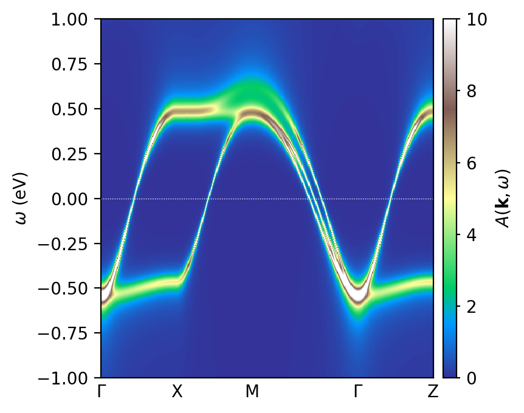

.. _tutorial_svo_akw:

Spectral function from DFT projectors: SrVO\ :sub:`3`
*****************************************************

.. contents:: Contents
   :local:
   :depth: 2

The momentum-resolved spectral function :math:`A(\mathbf{k},\omega)` is the
quantity that connects a DFT+DMFT calculation to angle-resolved photoemission
(ARPES). This tutorial computes it for SrVO\ :sub:`3`, reusing the converged
self-energy from :ref:`tutorial_svo_dmft`.

The point of this tutorial is a practical one. A DMFT loop runs on a
**k-mesh** — a regular grid covering the Brillouin zone, suitable for
:math:`\mathbf{k}`-sums. A band structure plot needs something different: the
Kohn-Sham Hamiltonian evaluated along a **high-symmetry path**. Those are
different sets of :math:`\mathbf{k}`-points, so the DFT code has to be re-run
in band mode to produce :math:`H(\mathbf{k})` and the projectors
:math:`P(\mathbf{k})` on that path. ModEST reads the result through a second
one-body-elements object built specifically for post-processing.

.. note::

   This is the DFT-converter (projector-based) route to
   :math:`A(\mathbf{k},\omega)`. :ref:`tutorial_sro_superdispersion` shows the
   other route — building the one-body elements from a Wannier90
   tight-binding model, where :math:`H(\mathbf{k})` can be evaluated at
   *arbitrary* :math:`\mathbf{k}`-points without re-running any DFT code.
   Compare the two: the tight-binding route is more flexible, the
   projector route stays closer to the original DFT calculation.

Learning outcomes
=================

By the end of this tutorial you will know how to:

* produce :math:`H(\mathbf{k})` along a high-symmetry path from a Wien2k
  calculation, and understand why this requires a separate band-mode DFT run
  rather than the DMFT k-mesh;
* load that path into a post-processing one-body-elements object with
  :py:func:`~triqs_modest.obe.one_body_elements_on_high_symmetry_path`;
* evaluate the interacting spectral function with
  :py:func:`~triqs_modest.post_processing.spectral_function_on_high_symmetry_path`,
  and choose a sensible ``broadening``;
* read the result as a false-color plot, and distinguish the renormalized
  quasiparticle bands from the incoherent weight.

Files
=====

This tutorial reuses the DFT archive and converged self-energy from
:ref:`tutorial_svo_dmft` — download them into your working directory:

* converted DFT archive: :download:`svo_dft_data.h5 <../svo_dmft/svo_dft_data.h5>`
* converged DMFT results: :download:`dmft_results.h5 <../svo_dmft/dmft_results.h5>`
* scripts: :download:`akw.py <akw.py>`, :download:`plot.py <plot.py>`

Step 1 — Regenerate :math:`H(\mathbf{k})` on a high-symmetry path
=================================================================

The archive ``svo_dft_data.h5`` produced in :ref:`tutorial_svo_dmft` contains
two distinct groups:

* ``dft_input`` — :math:`H(\mathbf{k})` and :math:`P(\mathbf{k})` on the regular
  k-mesh. This is what the DMFT loop sums over.
* ``dft_bands_input`` — :math:`H(\mathbf{k})` and :math:`P(\mathbf{k})` along a
  high-symmetry path (here :math:`\Gamma`–X–M–:math:`\Gamma`–Z, 500 points).
  This is what a band structure plot needs.

The second group does not come for free. On the Wien2k side you re-run the band
structure step (``x lapw1 -band`` with a ``case.klist_band`` defining the path),
re-run ``dmftproj`` so that projectors are generated on those same
:math:`\mathbf{k}`-points, and the converter writes them into
``dft_bands_input``. The self-energy is unaffected — it is local, so the same
:math:`\Sigma(\omega)` applies on any :math:`\mathbf{k}`-point — but
:math:`H(\mathbf{k})` and :math:`P(\mathbf{k})` genuinely have to be recomputed
where you want to plot them.

The shipped ``svo_dft_data.h5`` already contains both groups, so no Wien2k
installation is needed to follow along.

Step 2 — Compute :math:`A(\mathbf{k},\omega)`
=============================================

.. literalinclude:: akw.py
   :language: python

The calculation is four lines of ModEST. Working through them:

* The self-energy read from the archive is ``Sigma_w_m_dc`` — the
  **real-frequency**, double-counting-removed self-energy obtained by Padé
  continuation of the converged :math:`\Sigma(i\omega_n)`. That continuation
  step is described in :ref:`tutorial_svo_optics`; the shipped
  ``dmft_results.h5`` already contains its result, so it does not have to be
  redone here.

* Two one-body-elements objects are built, and this is the key step::

      _, obe = tm.one_body_elements_from_dft_converter("svo_dft_data.h5")
      obe = tm.one_body_elements_on_high_symmetry_path("svo_dft_data.h5", obe)

  The first call loads the k-mesh data and — importantly — establishes the
  correlated subspace ``obe.C_space``. The second call reads
  ``dft_bands_input`` and returns a *new* one-body-elements object living on the
  high-symmetry path, carrying that same correlated subspace over. Passing the
  original ``obe`` is what guarantees the path object describes the same
  correlated problem the DMFT loop solved, so the self-energy can be applied
  consistently.

* :py:func:`~triqs_modest.embedding.make_embedding` then embeds the impurity
  self-energy onto that subspace, exactly as in the DMFT loop, and
  :py:func:`~triqs_modest.post_processing.spectral_function_on_high_symmetry_path`
  evaluates

  .. math::

     A(\mathbf{k},\omega) = -\frac{1}{\pi}\,\mathrm{Im}\,\mathrm{Tr}\,
     \bigl[(\omega + \mu)\mathbb{1} - H(\mathbf{k}) - \Sigma(\omega)\bigr]^{-1}.

The ``broadening`` parameter adds a small imaginary part
:math:`i\eta` to :math:`\omega`. It exists to keep the plot smooth where the
self-energy alone provides too little damping — near :math:`\omega = 0` a
Fermi liquid has :math:`\mathrm{Im}\,\Sigma \to 0`, so the quasiparticle peak
would otherwise be a numerical delta function. Keep it small (here
:math:`\eta = 5`\ meV) so it does not mask the physical linewidth: the
broadening you see away from the Fermi level should come from
:math:`\mathrm{Im}\,\Sigma`, not from :math:`\eta`.

The :math:`\mathbf{k}`-sum is parallelized over MPI ranks::

    mpirun -n NCORES python akw.py

The result
==========

``plot.py`` reads the stored array and renders it as a false-color plot:

.. literalinclude:: plot.py
   :language: python

   The interacting spectral function :math:`A(\mathbf{k},\omega)` of
   SrVO\ :sub:`3` along :math:`\Gamma`–X–M–:math:`\Gamma`–Z.

Two things are worth reading off the figure. First, the three :math:`t_{2g}`
bands crossing the Fermi level are **sharp** near :math:`\omega = 0` and blur
out as you move away from it — a direct picture of the Fermi-liquid
:math:`\mathrm{Im}\,\Sigma(\omega) \sim \omega^2`: long-lived quasiparticles at
low energy, increasingly damped excitations at higher energy. Second, the
bandwidth is visibly compressed relative to the DFT dispersion. That
compression is the mass renormalization :math:`Z \approx 0.6` already visible
in the slope of :math:`\mathrm{Re}\,\Sigma(i\omega_n)` in
:ref:`tutorial_svo_dmft` — here it appears directly as bands squeezed toward
the Fermi level.

.. note::

   Padé continuation is the weak link in this chain. The self-energy is
   analytically continued from a noisy Monte-Carlo result, and continuation is
   an ill-conditioned problem — features far from :math:`\omega = 0` should be
   treated with more caution than the low-energy quasiparticle structure.

Takeaways
=========

* A DMFT loop runs on a k-*mesh*; a band plot needs a high-symmetry *path*.
  Those are different :math:`\mathbf{k}`-points, so the DFT code must be re-run
  in band mode to produce :math:`H(\mathbf{k})` and :math:`P(\mathbf{k})` there.
* The self-energy does *not* need recomputing — it is local, so the same
  :math:`\Sigma(\omega)` applies on any :math:`\mathbf{k}`-point.
* Pass the original ``obe`` to
  :py:func:`~triqs_modest.obe.one_body_elements_on_high_symmetry_path` so the
  path object inherits the correlated subspace the DMFT loop actually solved.
* Keep ``broadening`` small, so the linewidth you see comes from
  :math:`\mathrm{Im}\,\Sigma` rather than from :math:`\eta`.
