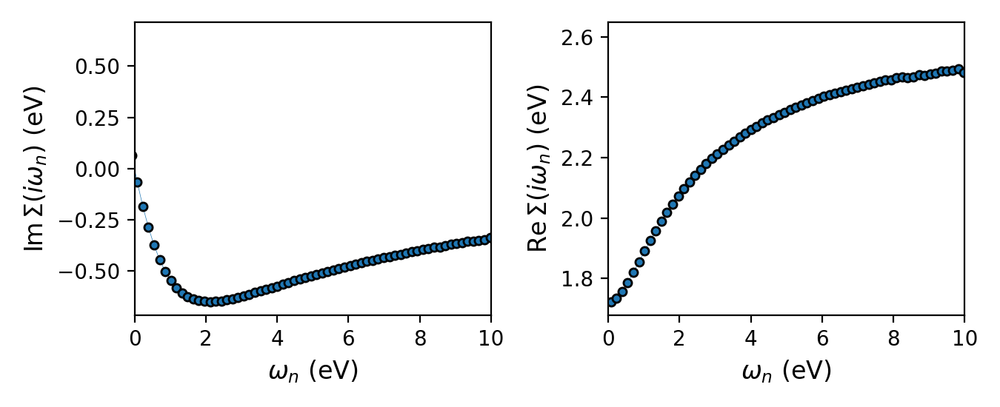

.. _tutorial_svo_dmft:

A one-shot DFT+DMFT calculation: SrVO\ :sub:`3`
***********************************************

.. contents:: Contents
   :local:
   :depth: 2

This is the starting point of the tutorial series: a complete, one-shot
(non-charge-self-consistent) DFT+DMFT calculation on the prototypical
correlated metal SrVO\ :sub:`3`. The latter tutorials, which covert more 
advanced topics, all build on this one, which is writing the DMFT loop.

SrVO\ :sub:`3` is a textbook moderately-correlated metal: cubic
(:math:`Pm\bar{3}m`), with a single electron in the three vanadium
:math:`t_{2g}` orbitals (:math:`d^1`). With :math:`U = 4.5`\ eV and
:math:`J = 0.68`\ eV it develops a renormalized quasi-particle
(:math:`Z \approx 0.6`) on top of the DFT band structure and remains metallic.

Learning outcomes
=================

By the end of this tutorial you will know how to:

* load DFT output into ModEST with
  :py:func:`~triqs_modest.obe.one_body_elements_from_dft_converter`, and read
  off the correlated subspace and target density it returns;
* build the :ref:`embedding <reference/python/embedding>` that routes
  quantities between the lattice and the impurity solver with
  :py:func:`~triqs_modest.embedding.make_embedding`;
* exploit orbital degeneracies with
  :py:func:`~triqs_modest.utils.analyze_gfs.analyze_degenerate_blocks` and
  :py:func:`~triqs_modest.utils.analyze_gfs.symmetrize`;
* assemble the DMFT self-consistency cycle — embed :math:`\Sigma`, find
  :math:`\mu`, compute :math:`G_{\mathrm{loc}}`, extract the hybridization
  :math:`\Delta`, solve the impurity problem — and understand what each step
  contributes;
* handle the double counting and the split of :math:`\Sigma` into its dynamic
  and static Hartree-Fock parts;
* checkpoint and restart a DMFT run with
  :py:class:`~triqs_modest.utils.checkpoint.Checkpointer` and
  :py:class:`~triqs_modest.utils.file_io.IterationData`.

Files
=====

Everything needed to run this tutorial is provided:

* DFT input: :download:`SrVO3.struct <SrVO3.struct>`,
  :download:`SrVO3.indmftpr <SrVO3.indmftpr>`
* converted DFT archive: :download:`svo_dft_data.h5 <svo_dft_data.h5>`
* scripts: :download:`dmft.py <dmft.py>`, :download:`plot.py <plot.py>`
* reference output: :download:`dmft_results.h5 <dmft_results.h5>`

Step 1 — Prepare the DFT input and projectors
=============================================

The correlated subspace is defined on the DFT side, before ModEST sees it. The
Wien2k structure and the ``dmftproj`` projection window are:

.. literalinclude:: SrVO3.indmftpr

Running Wien2k + ``dmftproj`` and converting with the Wien2k Converter provided
by `triqs_dftkit <https://triqs.github.io/dftkit/latest/>`_ produces
``svo_dft_data.h5``: the :math:`t_{2g}` projectors :math:`P(\mathbf{k})` and the
Kohn-Sham dispersion :math:`H(\mathbf{k})` on the DMFT k-mesh. That archive is
small enough to ship, so this tutorial is runnable end to end without a Wien2k
installation.

.. note::

   The archive also carries :math:`H(\mathbf{k})` along a high-symmetry path
   (``dft_bands_input``), which is what :ref:`tutorial_svo_akw` uses to plot the
   interacting spectral function :math:`A(\mathbf{k},\omega)`.

.. note::

  While we are using Wien2k here, this DFT+DMFT workflow is not Wien2k-specific. A
  similar script and workflow would be followed for any other DFT code.

Step 2 — Set up the problem
===========================

The complete loop lives in ``dmft.py``; this step and the two that follow walk
through it. Here it is in full:

.. literalinclude:: dmft.py
   :language: python

Three objects define the problem:

* :py:func:`~triqs_modest.obe.one_body_elements_from_dft_converter` returns the
  **target density** (how many electrons the correlated subspace must hold) and
  the **one-body elements** ``obe`` — :math:`H(\mathbf{k})`,
  :math:`P(\mathbf{k})`, and the correlated subspace ``obe.C_space``.
* :py:func:`~triqs_modest.embedding.make_embedding` builds the embedding ``E``
  from that subspace. For SrVO\ :sub:`3` this is as simple as it gets: one
  atom, one impurity, three degenerate :math:`t_{2g}` orbitals. (When the local
  basis is *not* this convenient, you can reshape the problem via the embedding 
  — that is the subject of :ref:`tutorials_rotating_to_a_local_basis`.)
* :py:func:`~triqs_modest.hamiltonians.make_kanamori` builds the local
  interaction from :math:`U`, :math:`U^\prime = U-2J`, and :math:`J`.

Before iterating we also run one non-interacting pass to find the degenerate
blocks:

.. literalinclude:: dmft.py
   :language: python
   :start-at: mu = tm.find_chemical_potential(target_density, obe, beta
   :end-at: mpi.report(f"degenerate blocks=

:py:func:`~triqs_modest.utils.analyze_gfs.analyze_degenerate_blocks` detects
which orbital blocks are equivalent by symmetry. Feeding that to
:py:func:`~triqs_modest.utils.analyze_gfs.symmetrize` later averages the
solver's stochastic noise over the three equivalent :math:`t_{2g}` channels,
which is free statistics.

Step 3 — Choose the double counting
===================================

DFT already includes some of the interaction we are about to add explicitly, so
a **double-counting** correction must be subtracted. Here we use a nominal
(fully-localized-limit-like) shift built from the nominal occupation
:math:`n_d = 1` of the :math:`d^1` configuration:

.. literalinclude:: dmft.py
   :language: python
   :start-at: nominal_d = 1.0
   :end-at: sig_dc =

The self-energy is carried in two pieces throughout the loop: a
frequency-dependent ``Sigma_imp_dyn`` and a static Hartree-Fock part
``Sigma_imp_hf``. The double counting is a static shift, so it lives in the
latter — and is subtracted off before the self-energy is embedded back into
the lattice problem.

Step 4 — Iterate to self-consistency
====================================

The body of the loop is the DMFT self-consistency condition, written out in six
sub-steps:

.. literalinclude:: dmft.py
   :language: python
   :start-at: Sigma_imp_hf_m_dc =
   :end-at: res = solve_generic

Reading it top to bottom:

1. ``E.embed(...)`` lifts the impurity self-energy (dynamic and static, in that
   order) from the solver's block structure onto the lattice's correlated
   subspace.
2. :py:func:`~triqs_modest.rho_and_mu.find_chemical_potential` adjusts
   :math:`\mu` so the correlated subspace holds ``target_density`` electrons
   *with the current self-energy in place*. This has to be redone every
   iteration, because :math:`\Sigma` shifts the spectral weight.
3. :py:func:`~triqs_modest.local_gf.gloc` performs the :math:`\mathbf{k}`-sum
   giving the local Green's function; ``E.extract`` projects it back down to
   the solver's block structure.
4. The impurity levels :math:`\epsilon_d` are shifted by :math:`\mu` and the
   double counting.
5. :py:func:`~triqs_modest.atomic_levels_and_delta.hybridization` produces
   :math:`\Delta(i\omega_n)`, the bath that the impurity sees.
6. ``solve_generic`` hands :math:`(\Delta, \epsilon_d, H_{\mathrm{int}})` to
   CT-HYB, which returns a new impurity self-energy — and the cycle repeats.

Convergence is monitored on the density residual
:math:`|n_{\mathrm{loc}} - n_{\mathrm{imp}}|`, and every iteration is written to
a checkpoint so the run can be restarted or post-processed later:

.. literalinclude:: dmft.py
   :language: python
   :start-at: ckpt.append(IterationData
   :end-at: break

Run it under MPI::

    mpirun -n NCORES python dmft.py

The result
==========

``plot.py`` reads the converged :math:`\mu` and :math:`\Sigma(i\omega_n)` and
plots the self-energy:

.. literalinclude:: plot.py
   :language: python

   The converged Matsubara self-energy. :math:`\mathrm{Im}\,\Sigma(i\omega_n)`
   (left) bends back toward zero as :math:`\omega_n \to 0` — the Fermi-liquid
   signature of a metal — and its slope near the origin sets the quasiparticle
   weight :math:`Z \approx 0.6`. :math:`\mathrm{Re}\,\Sigma(i\omega_n)` (right)
   tends to the static Hartree-Fock shift at large :math:`\omega_n`.

This converged self-energy is the input to most of what follows. It is saved as
``dmft_results.h5`` and reused directly by :ref:`tutorial_svo_optics` and
:ref:`tutorial_svo_akw`.

Takeaways
=========

* A DMFT calculation is assembled from three objects: the one-body elements
  (DFT input), the embedding (the lattice ↔ impurity routing table), and the
  interaction Hamiltonian. Everything else is the self-consistency cycle.
* :math:`\mu` must be redetermined every iteration, because the self-energy
  shifts spectral weight in and out of the correlated subspace.
* The self-energy is carried as two pieces — dynamic and static Hartree-Fock —
  and the double counting is a static shift that lives in the second.
* Checkpoint every iteration: it makes runs restartable and post-processing
  possible without re-running the solver.

Where to go next:

* :ref:`tutorials_rotating_to_a_local_basis` — what to do when the DFT basis is
  *not* as convenient as it is here, and the hybridization comes out
  off-diagonal.
* :ref:`svo_csc` — closing the charge self-consistency loop, feeding the DMFT
  charge density back into the DFT code.
* :ref:`tutorial_svo_akw` — the interacting spectral function
  :math:`A(\mathbf{k},\omega)` from this self-energy.
* :ref:`tutorial_svo_optics` — the optical conductivity from this self-energy.
