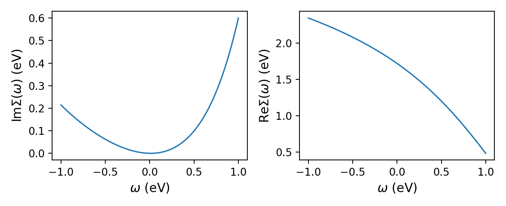
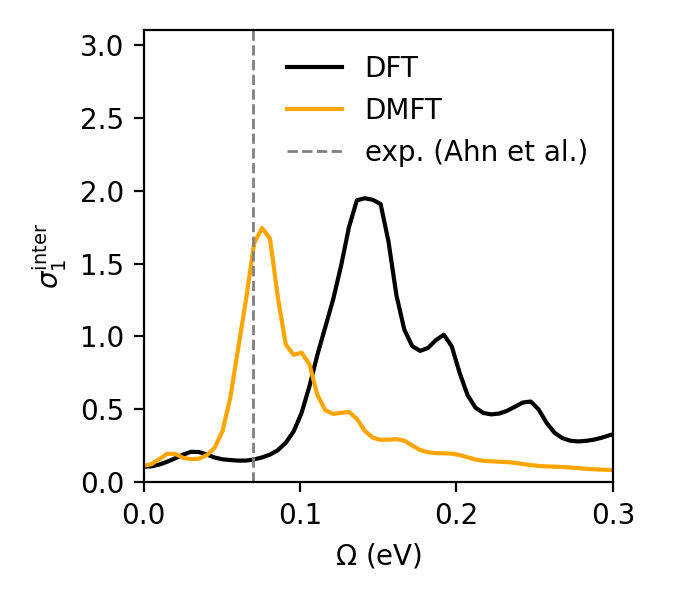

.. _tutorial_svo_optics:

Optical conductivity of SrVO\ :sub:`3`
**************************************

.. contents:: Contents
   :local:
   :depth: 2

This tutorial walks through a full DFT + DMFT calculation (one-shot) of the optical
conductivity of the prototypical correlated metal SrVO\ :sub:`3`, using
ModEST's Kubo-bubble transport post-processing. The goal is to reproduce the
central result of

    G. Ahn, M. Zingl, S. J. Noh, M. Brahlek, J. D. Roth, R. Engel-Herbert,
    A. J. Millis, and S. J. Moon,
    *Low-energy interband transition in the infrared response of the correlated
    metal SrVO*\ :sub:`3` *in the ultraclean limit*,
    `Phys. Rev. B 106, 085133 (2022) <https://doi.org/10.1103/PhysRevB.106.085133>`_,

namely a **weak interband transition near 70 meV** in the optical conductivity
:math:`\sigma_1(\Omega)`. This feature  arises from transitions between the :math:`t_{2g}` 
bands that are split by *orbital off-diagonal hopping*, which is renormalized by electronic 
correlations and is easily buried under the Drude peak in more disordered samples.

Learning outcomes
=================

This tutorial starts from the converged self-energy produced in
:ref:`tutorial_svo_dmft` — read that one first if you have not already. By the
end of this tutorial you will know how to:

* continue :math:`\Sigma(i\omega_n)` to the real-frequency axis with Padé
  approximants, as required by transport post-processing;
* evaluate the Kubo-bubble transport distribution
  :math:`\Gamma_{\alpha\beta}(\omega,\Omega)` with
  :py:func:`~triqs_modest.bubble.transport_distribution`, using band
  velocities computed on a dense :math:`\mathbf{k}`-mesh;
* integrate :math:`\Gamma` into the optical conductivity
  :math:`\sigma_1(\Omega)` with
  :py:func:`~triqs_modest.optics.optical_conductivity`, and distinguish its
  intraband (Drude) and interband contributions.

.. note::

   This tutorial analytically continues a converged self-energy and then
   evaluates the Kubo bubble. For the definitions, sign conventions, and
   **units** of every transport quantity, see :ref:`userguide_transport`.

Files
=====

For the transport calculation, we also need the **band velocities**
:math:`v(\mathbf{k})`, on a dense k-mesh. These can either be obtained from the electronic
structure code directly or a Wannier Hamiltonian. Here, we will highlight the case where the
velocity matrix elements are computed by the electronic structure code, in our case this is
Wien2k. In practice, these come from a second run of the Wien2k Converter provided by
`triqs_dftkit <https://triqs.github.io/dftkit/latest/>`_ over the same Wien2k
calculation, this time on a dense :math:`79\times79\times79` mesh; its
transport step writes :math:`H(\mathbf{k})` and :math:`v(\mathbf{k})` into
``svo_dft_optics.h5`` under ``dft_transp_input``. The self-energy is local and
therefore k-mesh-independent, so the :math:`\Sigma(i\omega_n)` converged on the
coarse DMFT mesh carries over unchanged.

The files for this tutorial are:

* from :ref:`tutorial_svo_dmft`:
  :download:`dmft_results.h5 <../svo_dmft/dmft_results.h5>` (the converged
  :math:`\mu` and :math:`\Sigma(i\omega_n)`)
* scripts: :download:`plot.py <plot.py>`, :download:`optics.py <optics.py>`

Step 1 — Continue the self-energy to real frequencies
=====================================================

Transport requires the self-energy on the real-frequency axis. We build it by
Padé continuation of the converged :math:`\Sigma(i\omega_n)`.

.. literalinclude:: plot.py
   :language: python
   :start-at: w_min, w_max = -1
   :end-before: om = np.fromiter(Sigma_w.mesh, float)

``plot.py`` reads :math:`\Sigma(i\omega_n)` and :math:`\mu` from ``dmft_results.h5``
and writes the continued ``Sigma_w_m_dc`` back into it. Padé is delicate; a smooth
low-energy :math:`\mathrm{Im}\,\Sigma(\omega)` with a quasiparticle dip at :math:`\omega = 0` 
indicates a reasonable analytic continuation:

Step 2 — Compute the optical conductivity
=========================================

With :math:`\Sigma(\omega)` and :math:`\mu`, the transport calculation
is two steps (see :ref:`userguide_transport`): the expensive, MPI-parallel
:math:`\mathbf{k}`-sum that builds the transport distribution
:math:`\Gamma_{xx}(\omega,\Omega)`, followed by the cheap Onsager moments integration.
The velocities and cell volume are loaded with ``read_velocities=True``.

.. literalinclude:: optics.py
   :language: python

Note the two calls:

* :py:func:`~triqs_modest.bubble.transport_distribution` evaluates the Kubo
  bubble on the external mesh ``Om_mesh`` (here :math:`\Omega \in [0, 0.5]`\ eV,
  which brackets the 70 meV feature). 
* :py:func:`~triqs_modest.optics.optical_conductivity` integrates :math:`\Gamma`
  into :math:`\sigma_1(\Omega)` (in :math:`10^{3}\,\Omega^{-1}\mathrm{cm}^{-1}`).

Running under MPI parallelizes the :math:`\mathbf{k}`-sum::

    mpirun -n NCORES python optics.py

The result
==========

Zooming into the low-energy region reveals the target feature: a weak peak in
:math:`\sigma_1(\Omega)` near :math:`\Omega \approx 70`\ meV, distinct from the
intraband Drude response. 

This peak is the interband transition identified in
`Phys. Rev. B 106, 085133 <https://doi.org/10.1103/PhysRevB.106.085133>`_:
transitions between :math:`t_{2g}` bands split by orbital off-diagonal hopping.
Its position and weight are set by the *correlated* band structure. The DMFT
self-energy renormalizes the splitting. 

.. note::

   While we reproduce the main physical result, the parameters used here, specifically, the Brillouin zone 
   mesh is not dense enough for converged optical conductivity results. In general, millions of k-points are
   needed to properly converge Brillouin zone integrals. For more details and information on advanced 
   algorithms for Brillouin zone integration, see `Phys. Rev. B 111, 195162 <https://doi.org/10.1103/PhysRevB.111.195162>`_.

Takeaways
=========

* Transport post-processing needs the band velocities :math:`v(\mathbf{k})` on
  a much denser mesh than the DMFT loop itself runs on. 
* The self-energy is local, hence mesh-independent: the
  :math:`\Sigma(i\omega_n)` converged on the coarse mesh carries over 
* Transport is evaluated in two stages: the expensive, MPI-parallel
  :math:`\mathbf{k}`-sum building :math:`\Gamma(\omega,\Omega)`, then the cheap
  Onsager integration into :math:`\sigma_1(\Omega)`.
* Brillouin-zone convergence is the practical bottleneck; the mesh used here
  reproduces the feature but is not converged.

